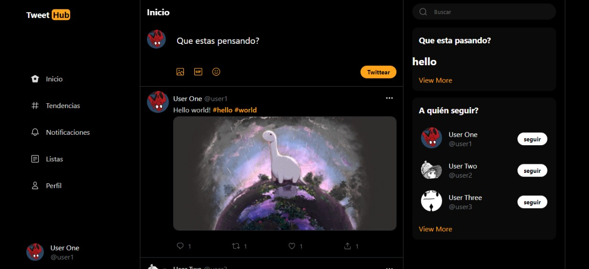
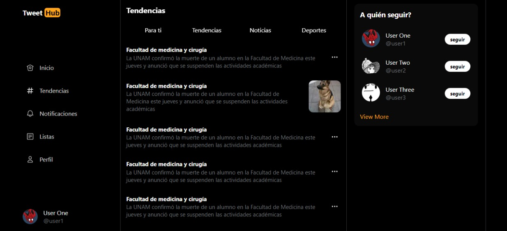
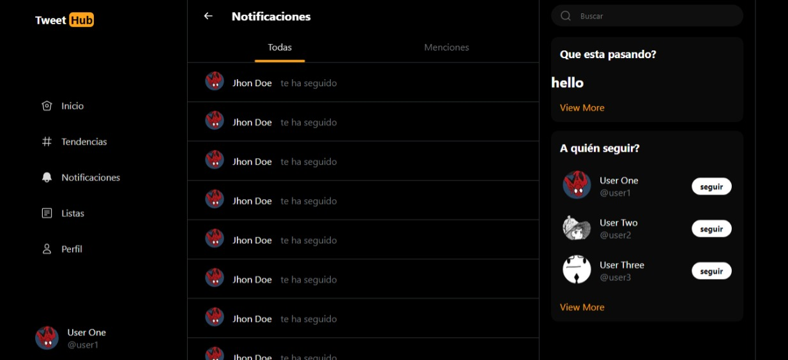
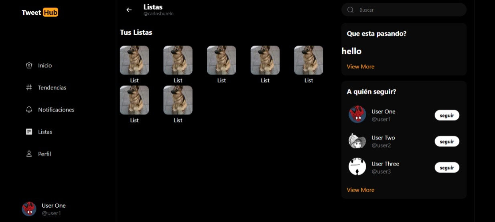
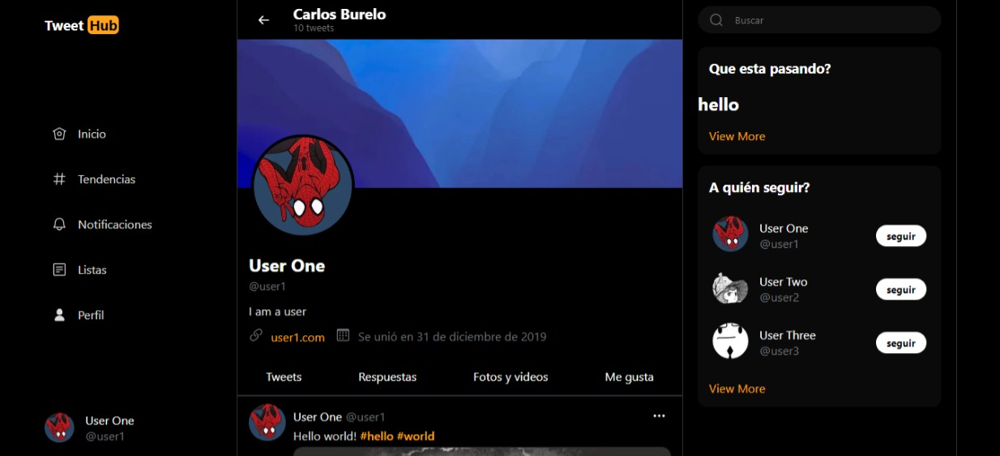

# Twtt

A simple social network focused on developers with tools for the creation of educational content with a twitter-like interface for an easy transition to the platform.

## Porpose

This project was born from my curiosity about how things work behind the scenes and to create a platform big enough to challenge me when developing it, since it would force me to think about all the areas that a social network covers when it is created. , topics such as cache, response times, user experience, scalability, etc.
Among other reasons is the fact of my fascination for sharing the content that I learn and what better way than to create a means by which those values ​​can be expressed by the rest of the participants.

## Features

- [x] GraphQL Server for the API
- [x] Twitter UI for the frontend (full responsive)
- [ ] Creating content threads made easy
- [ ] Sharing content with other users
- [ ] Searching for content by tags
- [ ] Authentication with username and password
- [ ] Session management based on jwt tokens
- [ ] User management with roles and permissions
- [ ] User profile management
- [ ] User avatar management

## Roadmap

[Roadmap and Schema](https://excalidraw.com/#json=nKxe7qNSrMiUMq1wcSjuJ,fWGRlfcn0XLLac9TzjyR9w)

## Preview
[Twwt V1](https://twtt-app.vercel.app)

or New Version
[Twtt V2](https://twtt.vercel.app)

### Home

### Trends

### Notifications

### Lists

### Profile

## Stack

- [x] Server - [GraphQL Yoga](https://www.graphql-yoga.com/)
- [x] UI Library - [React](https://reactjs.org/)
- [x] Client Framework - [Next.js](https://nextjs.org/)
- [x] Style Preprosessor - [Sass](https://sass-lang.com/)
- [x] Runtime - [Node.js](https://nodejs.org/)
- [x] Database - [MongoDB](https://www.mongodb.com/)
- [x] State Management - [Zustand](https://github.com/pmndrs/zustand)
- [x] Marked text - [react-snowdown](https://github.com/jerolimov/react-showdown)

#### Auhor: Carlos Burelo
